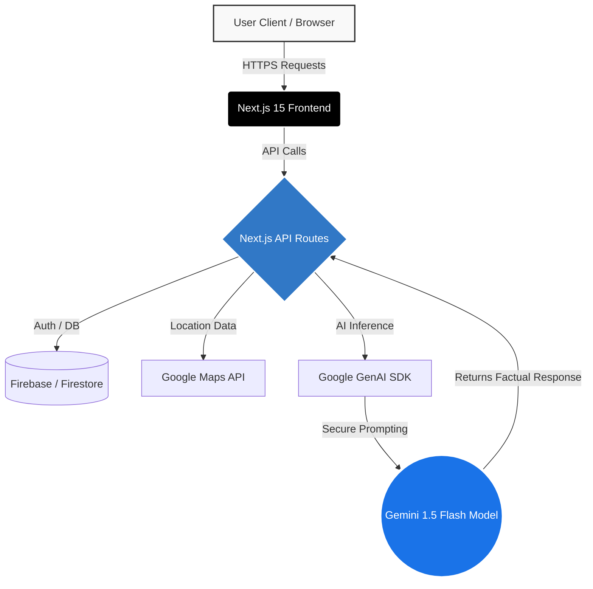
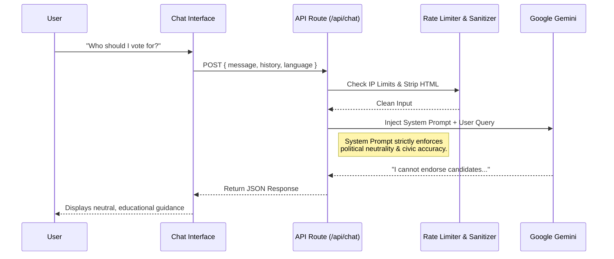

# ElectIQ 🇮🇳 
Your AI-Powered Civic Companion

  

## 📖 What is ElectIQ?

Elections are the backbone of democracy, yet the sheer volume of bureaucratic jargon, fragmented information, and complex procedures can alienate voters. **ElectIQ** is a conversational, AI-powered civic assistant designed to democratize election information. 

Built entirely on the Google Cloud ecosystem, ElectIQ acts as a living, context-aware companion that walks citizens through every phase of the election lifecycle—from voter registration and polling booth discovery to candidate research and results tracking. 

It is not a static FAQ board; it is a dynamic, multilingual intelligence engine that empowers voters with **neutral, factual, and hyper-personalized** civic guidance.

---

## 🎯 The Problem & Our Solution

### The Problem
Millions of eligible citizens miss out on their democratic right to vote simply because they don't understand the logistics. Official government portals are often dense and inaccessible to first-time voters, rural citizens, or those with low digital literacy. Furthermore, finding unbiased candidate information in the age of misinformation is incredibly difficult.

### The ElectIQ Solution
We bridge the gap between complex government procedures and the everyday citizen. By combining **Google Gemini 1.5 Flash** with real-time web infrastructure, ElectIQ translates bureaucratic noise into clear, actionable steps. Whether you are a 19-year-old student registering for the first time or a 55-year-old checking your polling station, ElectIQ provides answers in your preferred language, at your own pace.

---

## ✨ Core Features & Human Impact

### 1. Conversational Civic Assistant (The AI Core)
* **How it helps:** Users can ask anything in plain language (e.g., *"I just turned 18, how do I vote?"*). The AI remembers context and provides step-by-step guidance without overwhelming walls of text.
* **Behind the scenes:** User queries are sanitized and sent to Gemini via a Next.js API route. A highly tuned system prompt acts as a "guardrail," ensuring responses are accurate, legally sound, and strictly non-partisan.

### 2. The "Civic Treasure Map" (Visual Storytelling Timeline)
* **How it helps:** Demystifies the 9 phases of the Indian Election process via an interactive, S-curve visual timeline.
* **Behind the scenes:** A responsive CSS-grid structure dynamically renders the election path, visually connecting the dots from 'Election Announcement' to 'Government Formation'.

### 3. Intelligent Polling Booth Locator
* **How it helps:** Eliminates the confusion of finding where to vote. 
* **Behind the scenes:** Utilizes Google Maps integrations to map out nearby polling stations based on user queries or EPIC (Voter ID) number associations.

### 4. Strict Political Neutrality Engine
* **How it helps:** Protects voters from bias and propaganda.
* **Behind the scenes:** ElectIQ is hardcoded at the AI-instruction level to **refuse** endorsing or criticizing any political party or candidate. It acts strictly as an educational facilitator.

### 5. Multilingual Inclusivity
* **How it helps:** Breaks the English-only barrier, allowing users to interact in languages like Hindi, Tamil, and Telugu.
* **Behind the scenes:** Gemini natively processes and translates the nuance of Indian regional languages while retaining accurate civic terminology.

---

## 🧠 Architecture & Agent Mapping

ElectIQ utilizes a modern edge-compute architecture backed by powerful AI models. Below is the system flow demonstrating what happens the moment a user asks a question.

### 1. High-Level System Architecture



### 2. The AI Agent Workflow (Behind the Scenes)

When a user interacts with the Chat Assistant, a complex pipeline executes in milliseconds to ensure safety, accuracy, and neutrality:



---

## 🛠️ Step-by-Step Guide: How We Built This

ElectIQ was built to demonstrate how multiple Google Services can seamlessly integrate into a modern web framework to solve a real-world civic problem. 

### Step 1: Frontend & Layout Structuring
We started by establishing a high-performance Next.js 15 foundation using the App Router. We designed a premium "Civic Clarity" light theme using Tailwind CSS. We explicitly rejected generic AI-generated aesthetics (like glassmorphism) in favor of a trustworthy, government-portal-inspired design utilizing structured bento-grids and clean typography.

### Step 2: Google Maps & Location Awareness
We integrated the **Google Maps Platform** for the Polling Booth Locator. By detecting user locations (with permission), we dynamically render map instances showing nearest booths, ensuring users know exactly where to go on voting day.

### Step 3: Integrating Gemini AI (The Intelligence Layer)
We utilized the new `@google/genai` SDK to connect our backend directly to **Gemini 1.5 Flash**. We chose Flash for its extremely low latency, which is critical for real-time chat interactions. We wrote a robust System Prompt that acts as our AI's "Constitution"—instructing the model to act neutrally, accurately, and politely in 10+ Indian languages.

### Step 4: Structuring the Visual Timeline
We built the "Treasure Map" snake-flow diagram. Instead of a boring list of election phases, we created an interactive path tracking the election cycle. This required custom CSS-grid implementation to route the connector lines cleanly on both mobile and desktop screens.

### Step 5: Rate Limiting & Safety (The Guardrails)
To prevent abuse, we built custom IP-based rate limiters into our Next.js API routes. We also sanitize all HTML out of user inputs before passing the content to Gemini, ensuring secure inference.

### Step 6: Vertex AI & Google Cloud Credentials
We configured the project to use Google Cloud Application Default Credentials via Vertex AI for enterprise-grade security and API access, allowing seamless scaling and management of our AI workloads on Google Cloud.

---

## ☁️ Integrated Google Services & Technologies

Here is a comprehensive mapping of the Google Services used in this project:

| Technology / Service | How It Is Used In ElectIQ |
| :--- | :--- |
| **Google Gemini 1.5 Flash** | The core intelligence engine powering the conversational chat, translation, and candidate analysis. Chosen for its ultra-low latency. |
| **Google Cloud Vertex AI** | Handles the enterprise-level inference infrastructure, providing robust Application Default Credentials and security. |
| **Google Maps Platform** | Powers the interactive polling booth locator and dynamic routing for users trying to find where to vote. |
| **Firebase / Firestore** | (Architecture Planned) For real-time session tracking, chat history synchronization, and user preference storage. |
| **Next.js 15 (App Router)** | The full-stack React framework managing our React Server Components and the backend API routes connecting to Gemini. |
| **Tailwind CSS & Framer Motion** | Powers the responsive, "Civic Clarity" premium UI and micro-interactions. |

---

## 🚀 How to Run Locally

Want to run the civic assistant on your own machine? Follow these steps:

### 1. Clone & Install
```bash
git clone https://github.com/yourusername/electiq.git
cd electiq-app
npm install
```

### 2. Configure Environment Variables
Create a `.env.local` file in the root directory and add your Google credentials:

```env
# Required: Your Google Gemini API Key (from Google AI Studio)
GOOGLE_API_KEY=your_api_key_here

# Required: Google Maps API Key
NEXT_PUBLIC_GOOGLE_MAPS_API_KEY=your_maps_key_here

# (Optional) If using Vertex AI Application Default Credentials:
# GOOGLE_CLOUD_PROJECT=your_project_id
```

### 3. Start the Development Server
```bash
npm run dev
```
Open [http://localhost:3000](http://localhost:3000) with your browser to explore ElectIQ.

---

## 🌟 Why This Matters (The 1% Impact)

ElectIQ is not just a technical demonstration; it is a **scalable civic infrastructure tool**. 

By leveraging the speed and contextual reasoning of Gemini 1.5 Flash, we are fundamentally changing how citizens interact with their government. Instead of searching through static PDFs, a voter in a remote village can ask a question in Hindi and instantly receive a factual, neutral, and empowering answer. 

**ElectIQ doesn't just provide information—it builds civic confidence.**
